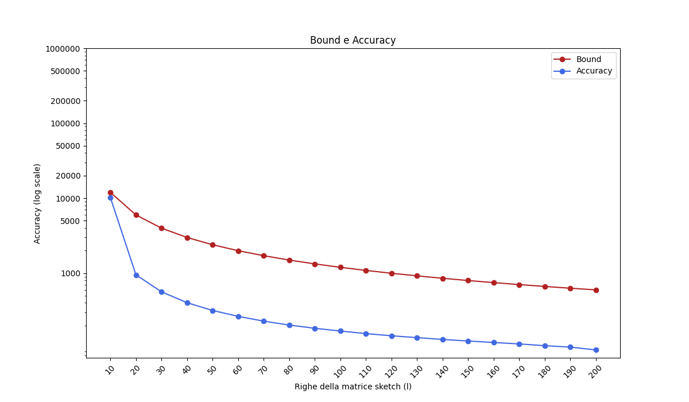
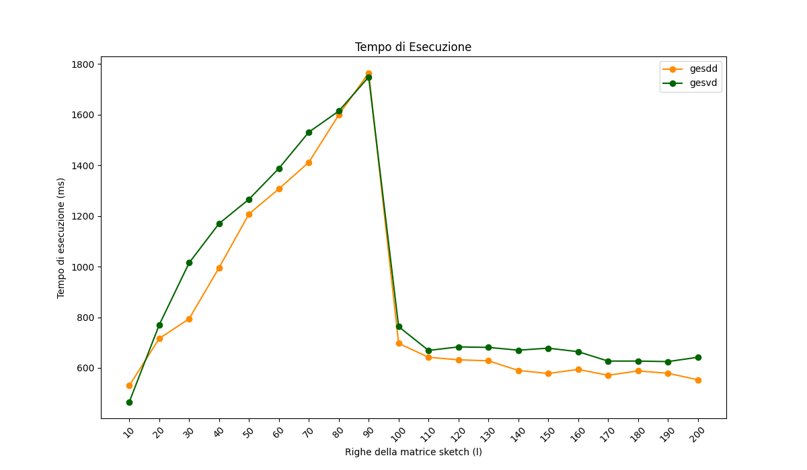
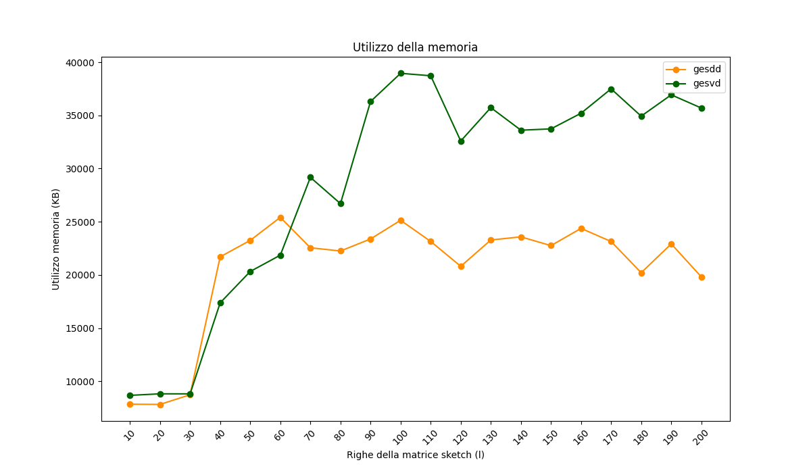

# Frequent Directions

This GitHub repository contains a C++ implementation of the Frequent Directions algorithm (Liberty, 2013) for Linux systems. It uses the Blaze, OpenBLAS and LAPACK libraries for high-performance linear algebra calculations, and cxxopts for command line argument parsing.

## Installation

Run  `install_libraries.sh` to install the required libraries (if they aren't already installed) and `compile.sh` to compile with CMake.

## Usage

Run `./frequent_directions -i <input-file-name.csv> -l <rows number of the sketch matrix>` to perform a matrix sketching, using by default the 'dgesdd' function from the LAPACK library for the SVD computation.  

It is possible to use the 'dgesvd' function by running:  
`./frequent_directions -i <input-file-name.csv> -l <rows number of the sketch matrix> --svd gesvd`  

It is also possible to explicitly require the 'dgesdd' function:  
`./frequent_directions -i <input-file-name.csv> -l <rows number of the sketch matrix> --svd gesdd`  

Run `./frequent_directions -i <input-file-name.csv> -l <rows number of the sketch matrix> --svd <svd function> --mode acc` to save to a csv file (after performing the matrix sketching):
* Rarameter l (number of rows for the sketch matrix)
* Running time
* Theoretical upper bound for the sketch's accuracy
* Actual accuracy
* Memory usage

In addition, by adding the `--bench` flag, the execution of the algorithm is repeated 10 times in order to provide more accurate estimates of running time and memory usage.

Running the program with `mode --ronly` will only perform matrix reduction, the same as not using the 'mode' option at all.

With `./frequent_directions -i <input-file-name.csv> -l <rows number of the sketch matrix> --bound` the program outputs the theoretical upper bound on the accuracy, given the parameter l.

Run `./frequent_directions -i <input-file-name.csv> -l <rows number of the sketch matrix> --acctest` to print the accuracy of an already generated sketch with l rows.

It is possible to test the program by running `test.py [[file1.csv] [file2.csv] [file3.csv]]`. 
This Python script can take up to three arguments representing the names of the input files. The script runs the FD algorithm iteratively on each matrix, on a list of l values (generated according to their number of columns) with the `--mode acc` and `--bench` flags, using the two LAPACK functions 'dgesvd' and 'dgesdd' to compute the SVD. Finally, the script plots the generated results.

The same can be achieved by executing the bash script `benchmark.sh [[file1.csv] [file2.csv] [file3.csv]]`

## Example

The program can be tested on `smallMatrix.csv`, a 10000x100 double precision matrix included in this repository, using `python3 smallMatrix.csv` or `./benchmark.sh smallMatrix.csv`.

The following plots are generated: 

Bound and Accuracy  

Running Time  

Memory Usage  

## References

* Liberty, E. (2013) [Simple and deterministic matrix sketching](http://www.cs.yale.edu/homes/el327/papers/simpleMatrixSketching.pdf)
* Philips, J. [Algorithms, Geometry, and Probability (Ch. 16)](https://users.cs.utah.edu/~jeffp/DMBook/L16-MatrixSketching.pdf)